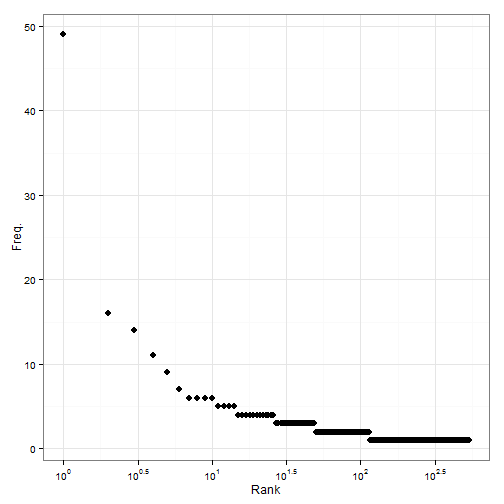

<!-- Limit image width and height -->
<style type='text/css'>
img {
    max-height: 400px;
    max-width: 400px;
}
</style>

## Introduction

WebPageAnalyser is an example of shiny application. It demonstrates web page scraping, parsing HTML and presentation results on graphic. This presentation describes R code used in the application.

WebPageAnalyser based on packages: 


```r
library(XML)  # Used to parse HTML code
library(ggplot2)  # Used to plot grafics 
library(scales)  # Used to scale grafics
```

---

## Load and parse HTML page
Code chunk presented below implements web page scraping and parsing HTML content.
The result is a list of words used in the text on analyzed web page.

```r
# Fetch html page and merge all strings to one.
web.content <- paste(readLines("http://news.yahoo.com"), "\n", collapse = "")
# Parse html.
web.tree <- htmlTreeParse(web.content, asText = TRUE, useInternalNodes = T)
# Extract text content.
web.text <- paste(xpathSApply(web.tree, "//p", xmlValue), " ", collapse = " ")
# Parse text to create word list.
web.words <- tolower(unlist(strsplit(web.text, "[ .,;!?\"\\[\\)\\(]")))
```

---

## Processing word list
Word list obtained above used to builed table with words frequencies. 

```r
# Build table with words frequencies.
web.words.table <- data.frame(table(web.words[nchar(web.words) > 2]), stringsAsFactors = F)
# Sort table by frequencies
web.words.table <- web.words.table[order(web.words.table$Freq, decreasing = T), 
    ]
# Add word rank to the table
web.words.table[, 3] <- seq(nrow(web.words.table))
# Change row and column names
names(web.words.table) <- c("Word", "Freq", "Rank")
rownames(web.words.table) <- NULL
```

The result of this code is a table:

```
##   Word Freq Rank
## 1  the   49    1
## 2  and   16    2
```

---

## Result
WebPageAnalyser used ggplot function to build grafic.

```r
ggplot(web.words.table, aes(x = Rank, y = Freq)) + geom_point(size = 3) + xlab("Rank") + 
    ylab("Freq.") + theme_bw() + scale_x_log10(breaks = trans_breaks("log10", 
    function(x) 10^x), labels = trans_format("log10", math_format(10^.x)))
```

 

